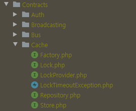
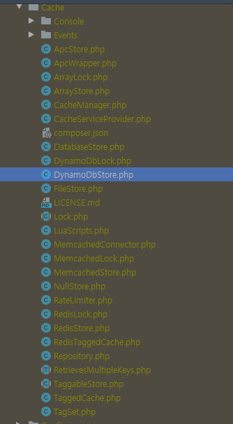

# Contracts
- 라라벨에서 프레임워크에서 제공하는 기능들을 사용하기 쉽게 만들어논 인터페이스 세트이다.
- contracts 새로운 용어가 아니고 개발자들사에어 쓰이던 보편적인 용어이다(interface,abstract class 둘다 포함)
- TAYLOR(라라벨 개발자)가 라라벨에서 제공하는 기능들을 사용하기위한 인터페이스 모음을 좀더 specific하게 지칭하기위해 사용한듯
- ex) Cache 관련 인터페이스들

    

- ex) Cache 구현체들

    

- larave vs facade 굳이 왜 비교하는지 모르겠음 그냥 다른건데..

## 인터페이스
- 왜 인터페이스를 사용하냐
    - 결합도를 낮추기 위해
        - 인터페이스를 사용하면 구체적인 구현 형식이 변함에따라 사용하는 쪽은 영향을 받지 않는다.
        - 유지보수에 편하다.
    - 개발시간 단축
    - 표준화 
    - 단순성
        - 구체적인 구현체를 보는거보다 인터페이스를 통해 프레임워크의 기능들을 간결하게 볼수있다.
